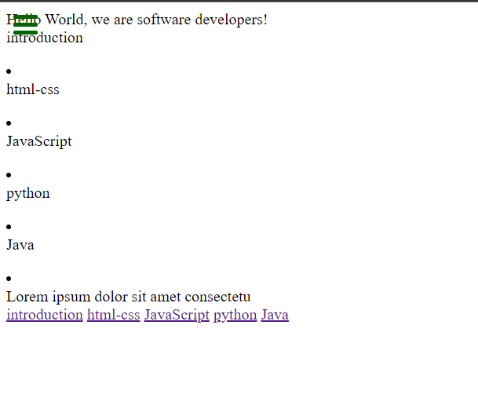

# Review your project from trials!

> This project is used to learn how to do a proper code review.

This is a code review of one of the projects of the trials.

## Built With

- HTML & CSS
- Node

## Getting Started

To get a local copy up and running follow these simple example steps.

### Setup
You can go to `Code > Clone` and copy the link

### Install
Go to the git bash on your local machine and clone it to your local repository using the command 

    $ git clone "repo link"

### Usage
Open [index file](index.html) to see the webpage

## Authors

👤 **Leonardo Pareja**

- GitHub: [@MacCrazyman](https://github.com/MacCrazyman)

## 🤝 Contributing

Contributions, issues, and feature requests are welcome!

Feel free to check the [issues page](../../issues/).

## Show your support

Give a ⭐️ if you like this project!

